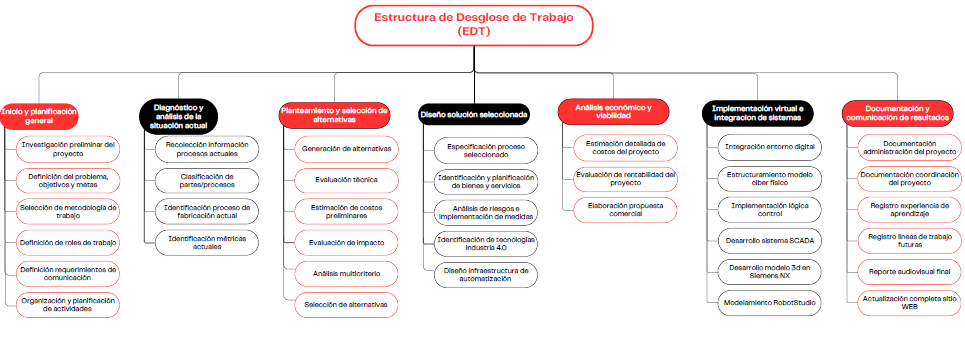
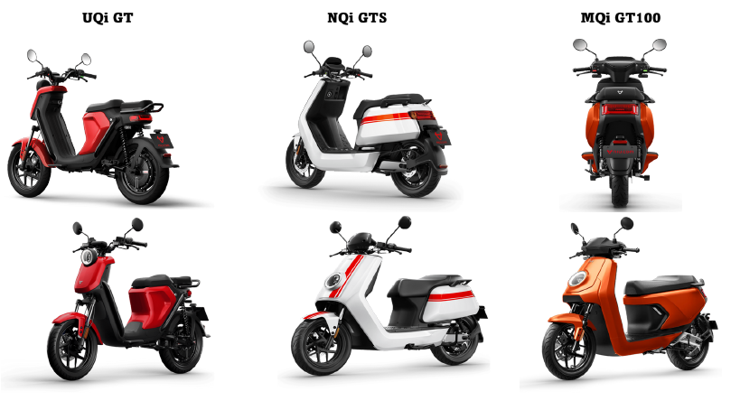
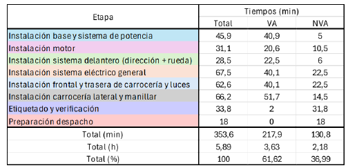
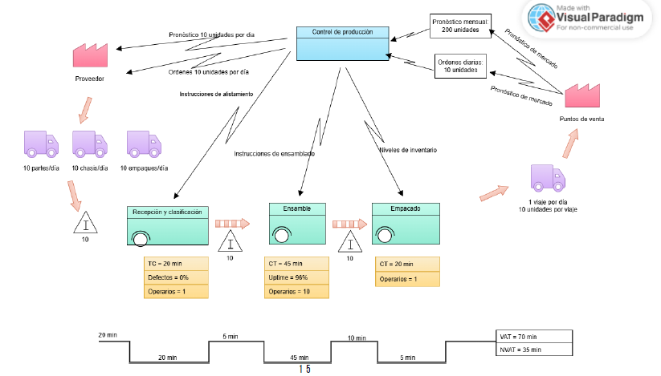
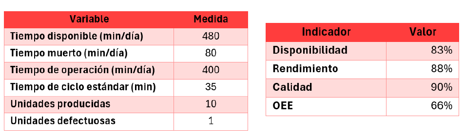
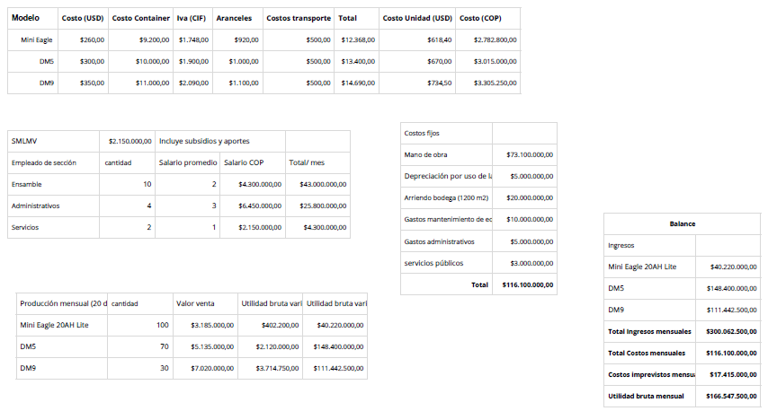
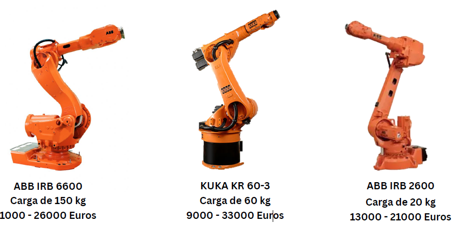
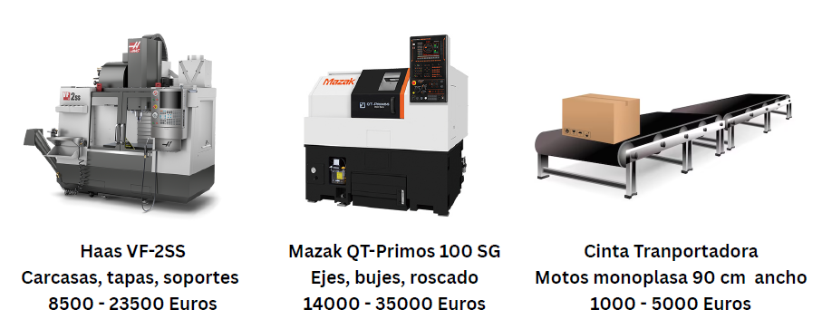

# Proyecto Integrador APM – Electric Dragon Motors

**Universidad Nacional de Colombia – 2025-1**  
Facultad de Ingeniería – Automatización de Procesos de Manufactura  
Autores: Catalina Criollo, Jonathan Jiménez, Oscar Restrepo, Rodrigo Vera, Yeira Rodríguez

---

## Índice

1. [Planificación del Proyecto](#planificación-del-proyecto)  
2. [Planteamiento y Objetivos](#planteamiento-y-objetivos)  
3. [Investigación de Mercado](#investigación-de-mercado)  
4. [Análisis Línea No Automatizada](#análisis-línea-no-automatizada)  
5. [Perspectivas Futuras y Evaluación Económica](#perspectivas-futuras-y-evaluación-económica)

---

## Planificación del Proyecto

La planificación del proyecto "Electric Dragon Motors" se estructuró en una serie de fases siguiendo una metodología clara y organizada. Se inició con la definición del problema y los objetivos generales y específicos, para luego establecer una Estructura de Desglose del Trabajo (EDT) que guiara todas las etapas subsiguientes. Esta estructura incluyó el diagnóstico del estado actual, la generación y evaluación de alternativas, el diseño de la solución, el análisis económico y la implementación virtual.

Se elaboró un diagrama de Gantt para establecer un cronograma de actividades que incluyera tiempos, responsables y entregables. Este cronograma permitió visualizar el avance del proyecto y tomar decisiones de ajuste cuando fue necesario. Además, se utilizó una matriz RACI para definir los roles y responsabilidades del equipo, asegurando una distribución adecuada de tareas y una comunicación efectiva entre los miembros.
### Estructura de Desglose del Trabajo (EDT)

---

## Planteamiento y Objetivos

La problemática central identificada radica en la baja eficiencia, flexibilidad y trazabilidad de las líneas de producción de motocicletas eléctricas. En un mercado con creciente demanda y variabilidad de modelos, los sistemas de ensamblaje tradicionales no logran adaptarse rápidamente a los cambios, comprometiendo la calidad y seguridad operativa.

El objetivo general del proyecto fue diseñar y validar un sistema automatizado de manufactura para motos eléctricas, incorporando estaciones robotizadas, herramientas de control industrial y un análisis técnico-económico robusto. Esto busca incrementar la eficiencia, flexibilidad y sostenibilidad del proceso productivo.

Entre los objetivos específicos destacan: caracterizar el proceso actual, diseñar una solución integral de automatización, integrar tecnologías emergentes de Industria 4.0 como sensores IIoT, plataformas SCADA y controladores PLC, y finalmente, evaluar la viabilidad técnica y económica de la propuesta.

---

## Investigación de Mercado

### Análisis del Mercado
El análisis de mercado reveló una tendencia creciente en la adopción de vehículos eléctricos, especialmente motocicletas, impulsada por la necesidad de alternativas sostenibles y eficientes para la movilidad urbana. En el año 2024 se registraron más de 40.000 importaciones de bicicletas eléctricas y se vendieron más de 800.000 motos de combustión, lo que demuestra el potencial de migración hacia tecnologías limpias.

Se analizaron tres modelos principales de motocicletas eléctricas: MQi GT, NQi GTS y UQi GT, cada uno con especificaciones técnicas distintas en cuanto a potencia, autonomía, velocidad y prestaciones tecnológicas como frenado inteligente o conectividad vía app. Los precios oscilan entre $4.9 y $10.8 millones COP, permitiendo cubrir diferentes segmentos del mercado.

### Productos

| Modelo   | Potencia | Velocidad | Autonomía | Precio |
|----------|----------|-----------|-----------|--------|
| MQi GT   | 1500W    | 45 km/h   | 75 km     | $4.900.000 |
| NQi GTS  | 3500W    | 80 km/h   | 114 km    | $7.900.000 |
| UQi GT   | 6000W    | 100 km/h  | 128 km    | $10.800.000 |

### Listado de partes
Adicionalmente, se realizó un desglose completo de partes y componentes clave en la estructura de estos modelos, identificando oportunidades de estandarización y ensamblaje modular.

Estas partes son: 

1. Rueda trasera.
2. Manillar delantero.
3. Manillar trasero.
4.  Panel.
5.  Cubiertadelantero.
6.  Cubierta de la rueda delantera.
7.   Horquilla delantera.
8.   Sistema de frenado combinado.
9.   Rueda delantera.
10.   Componentes eléctricos.
11.   Parte media.
12.   Cubierta derecho e izquierdo.
13.   Cuerpo inferior.
14.   Carrocería parte trasera.
15.   Silla y batería.
16.   Soportes lateral y central.
17.   Componentes traseros.
18.   Horquilla trasera

---

## Análisis Línea No Automatizada

### Procesos actuales
Se realizó un levantamiento de la línea de ensamblaje actual, la cual consta de procesos manuales para la recepción, clasificación, ensamblaje y despacho de componentes. Esta estructura presenta cuellos de botella en la sincronización de tareas, alta dependencia de mano de obra y baja capacidad de trazabilidad.

El mapeo de valor (pre-VSM) permitió identificar ineficiencias en los tiempos de ciclo y en la logística interna. Las métricas actuales indicaron una producción mensual de 200 unidades distribuidas entre los tres modelos analizados.

Este diagnóstico sirvió de base para el rediseño del proceso con miras a su automatización total o parcial mediante celdas robotizadas y sistemas inteligentes de transporte.

### Tiempos de Ensamblaje actuales

### Pre-VSM

### Métricas actuales

---

## Perspectivas Futuras y Evaluación Económica

### Costos Preliminares

El análisis económico del proyecto incluye los costos de adquisición por unidad de los tres modelos, así como los costos operativos mensuales: mano de obra, arriendo, mantenimiento, servicios y gastos administrativos. Los resultados indican una utilidad bruta mensual de más de $166 millones COP, demostrando la rentabilidad del modelo automatizado.

### Celdas Robóticas Preliminares

En cuanto a la automatización, se evaluaron diferentes opciones de celdas robóticas. Entre ellas: el ABB IRB 6600 (150 kg de carga), el KUKA KR 60-3 (60 kg) y el ABB IRB 2600 (20 kg), según las necesidades de cada etapa del proceso. También se consideró la integración de centros de mecanizado CNC como el Haas VF-2SS y el Mazak QT-Primos para la fabricación de carcasas y ejes.

Se incluyó además la instalación de una cinta transportadora especializada para motocicletas monoplaza, optimizando los tiempos de desplazamiento entre estaciones.

